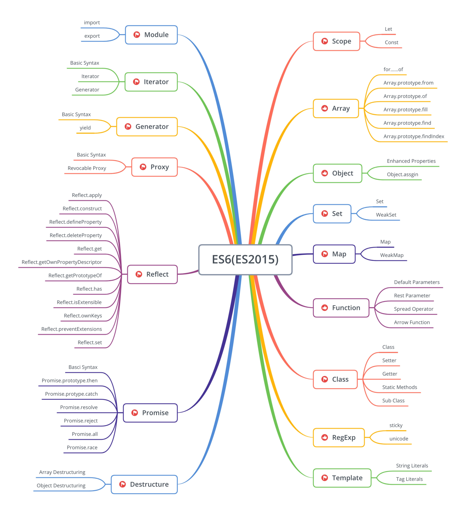

### Extra

```js
const mergebyId = arr => {
  return arr.reduce((prev, curr) => {
    let flag = 0;
    for (let item of prev) {
      if (item.id === curr.id) flag = 1;
    }
    return flag ? prev : prev.concat(curr);
  }, []);
};
```