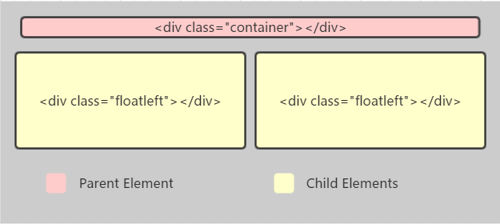
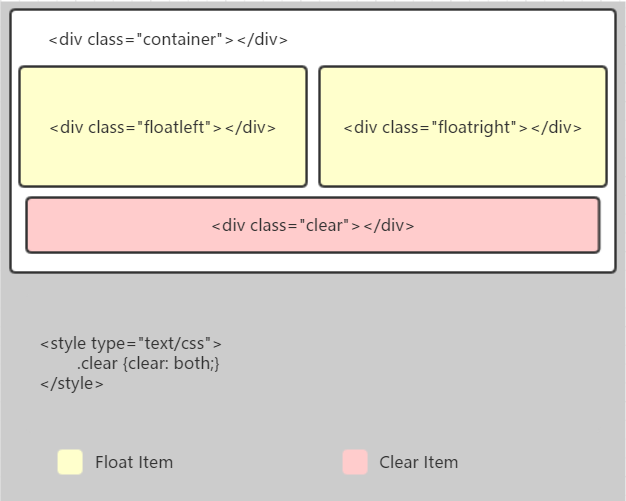
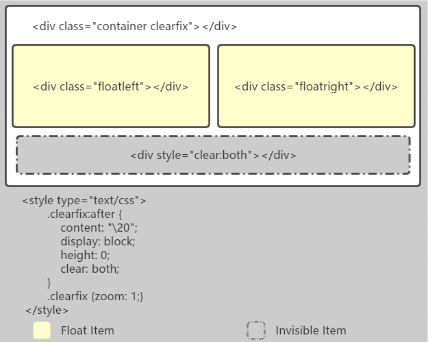

## 一、浮动的概念

> 浮动的框可以向左或向右移动，直到它的外边缘碰到包含框或另一个浮动框的边框为止。
> 由于浮动框不在文档的普通流中，所以文档的普通流中的块框表现得就像浮动框不存在一样。

## 二、浮动的影响

### 1. 浮动会导致父元素高度坍塌

父元素中有子元素，并且父元素没有设置高度，子元素在父元素中浮动，结果必然是父元素的高度为0，这也就导致了父元素高度塌陷问题。

浮动脱离文档流，这个问题会对整个页面布局带来很大影响，如何解决高度坍塌问题，我们需要清除浮动。

## 三、浮动的清除

### 1. clear属性的空标签

在浮动元素后添加一个空标签`

`，并且在CSS中设置`.clear{clear:both;}`，即可清理浮动。

- 原理：添加一个空标签，利用CSS提高的clear:both清除浮动，让父元素可以自动获取到高度
- 优点：简单，代码少，兼容所有浏览器
- 缺点：增加页面的标签，造成结构的混乱
- 建议：不推荐使用，此方法已经过时

### 2. :after伪元素

给浮动元素的容器添加一个`clearfix`的class，然后给这个class添加一个`:after`伪元素实现元素之后添加一个看不见的块元素（Block element）清理浮动。

- 原理：通过CSS伪元素在容器的内部元素之后添加一个看不见的空格“/20”或点“.” ，并且设置clear属性清除浮动。
- 优点：浏览器支持较好
- 缺点：clearfix这个class需要添加zoom: 1（触发haslayout），才能支持IE6和IE7浏览器
- 建议：推荐使用，设置公共类，减少CSS代码

> 转载自：https://segmentfault.com/u/webing123