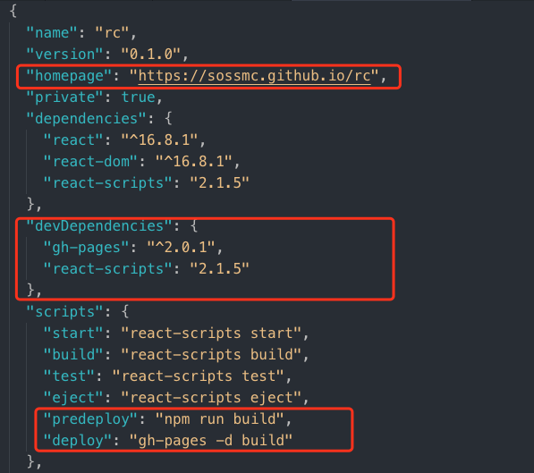

#### 1. 首先先创建git仓库

​	详细操作参见其他教程

#### 2. 使用create-react-app初始化项目

​	略，并push到远程仓库

#### 3. 修改`package.json`

添加 homepage和`script`部署脚本部分

> script运行顺序 preXXX > XXX > postXXX
>
> 所以执行 npm run deploy会自动执行npm run predeploy

修改后也push做一次保存

#### 4. 部署

- 用 `npm install`或者`yarn install`安装依赖包

- 再使用 `npm run deploy`或者`yarn deploy`进行自动构建和发布

  > 这步可能需要 `yarn add gh-pages (npm  install gh-pages -D)`安装gh-pages
  >
  > 但是上边devDependencies有添加依赖的童鞋应该在`yarn install`的时候已经自动完成了

- `gh-pages -d build `会自动将`./build`内的东西发布到`gh-pages`分支, Github会自动将gh-pages分支的内容发布到 `[yourname].github.io/[projectname]`上

  

#### 5. 关于自定义域名

有时候想要自定义域名到自己的域名下(需要到自己域名控制台添加转发解析)，就可以使用Github Pages提供的自定义域名功能。

自定义域名其实在代码库里直观改变就是添加了一个含有域名信息的`CNAME`文件，每次执行 `npm run deploy`或者`yarn deploy`后，都会发现`gh-pages`分支下的`CNAME`文件又没了。

这里提供一个解决方法，将`predeploy`的内容修改为

`"predeloy": "npm run build & echo \"[customdomain.com]\" > build/CNAME",`

同时注意，记得修改`"homepage"`字段哦。

